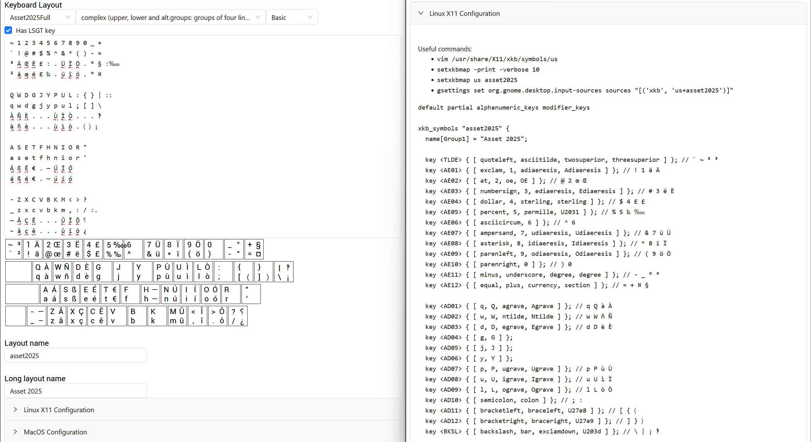

# XKeyboard

XKeyboard is a web keyboard layout descriptor for X11-based window systems, for
MacOS and for MSKLC for Windows. The keyboard layout is defined by a simple enumeration of the keys of the keyboard. XKeyboard generates the corresponding XKB symbol configuration file for X11, KeyLayout XML configuration for MacOS and MSKLC .klc text file for Windows.

XKeyboard is accessible at:

- https://xkeyboard.ea9c.com/
- https://xkeyboard.vercel.app/

XKeyboard is Open Source and is JAM licensed.

