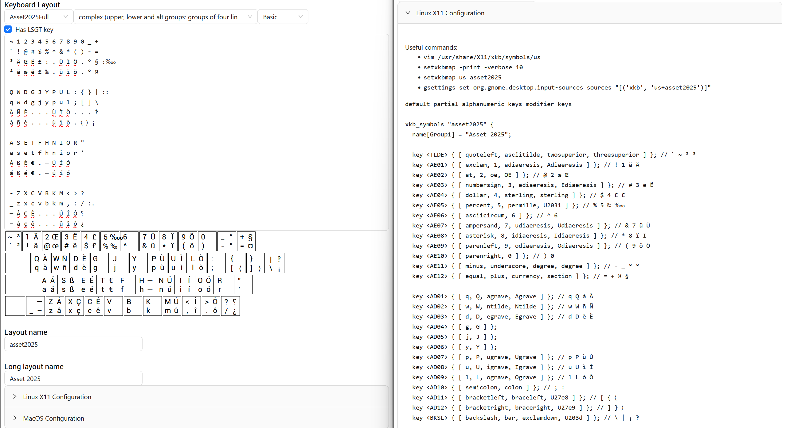

# XKeyboard

XKeyboard is a web keyboard layout descriptor for X11 / Wayland, Linux virtual
consoles, MacOS and MSKLC for Windows. The keyboard layout is defined by a simple
enumeration of the keys of the keyboard. XKeyboard generates XKB symbol files,
Linux loadkeys .map overlays, KeyLayout XML for MacOS and MSKLC .klc files for Windows.

XKeyboard is accessible at:

- https://xkeyboard.ea9c.com/
- https://xkeyboard.vercel.app/

XKeyboard is Open Source and is JAM licensed.



## Linux loadkeys

The Linux loadkeys tab exports a UTF-8, LF-terminated `.map` overlay for the Linux
virtual console. It does not configure X11, Wayland, terminal emulators or SSH.
Install your distribution's `kbd` tools and make the `us` console keymap available.
The overlay changes printable keys; the US baseline supplies Space, Enter,
modifiers, function keys, navigation and keypad behavior.

Run these commands from a Linux virtual console, replacing `layout.map` with the
downloaded filename. Keep a recovery session available: loading a map affects all
virtual consoles and login prompts, and lasts beyond the current login session.

```sh
# Back up the current console keymap before making changes.
sudo dumpkeys > console-backup.map

# Validate the baseline and overlay without changing any keyboard bindings.
loadkeys --parse us ./layout.map

# Enable Unicode keyboard input on the current virtual console.
sudo kbd_mode -u

# Load the US baseline and then apply the custom printable-key overlay.
sudo loadkeys us ./layout.map

# Restore the backed-up keyboard bindings if needed.
sudo loadkeys ./console-backup.map

# Inspect hardware keycodes; showkey exits after ten seconds without input.
sudo showkey --keycodes
```

Restoring the keymap does not restore the previous keyboard mode. Check the mode
with `kbd_mode` before changing it. Unicode output also needs an appropriate
console font; a valid mapping does not guarantee that every glyph can be displayed.

Simple layouts repeat plain/Shift on the AltGr levels. Complex layouts use all
four supplied levels and bind right Alt to AltGr. Empty complex levels emit
`VoidSymbol`. Ctrl combinations use conventional ASCII control codes derived
from the assigned character, and Alt/Meta output supports ASCII only; unsupported
combinations produce no output. Caps Lock supports ASCII and Latin-1 case pairs,
but not arbitrary Unicode case pairs. Accents are literal characters, not dead
keys, and the overlay does not add compose definitions.

Each populated entry must be one printable Unicode scalar below U+F000, excluding
surrogates and control characters. Multi-character entries, supplementary-plane
characters, unsupported physical positions and duplicate keycodes block export.
TypeMatrix uses the same standard PC keycodes as the other exporters; verify
them on your hardware with `showkey --keycodes`.

Boot-time installation is distribution-specific. Arrange for the baseline to
load before the overlay; this file is not a complete standalone `KEYMAP`.

## Development

### Layout presets

Vite imports all `layout/**/*.txt` files as strings. Each file starts with four
metadata lines: configuration name, display name, `simple` or `complex`, and
`LSGT` or `noLSGT`. The remaining lines contain whitespace-separated key symbols.
Simple layouts use groups of two lines (upper, lower); complex layouts use four
(upper, lower, AltGr upper, AltGr lower). Blank separator lines are ignored.
There must be one to five complete groups, with at most 14 key columns per line.
Short modifier rows are padded with empty keys by the keyboard parser.

Each symbol is a single printable Unicode scalar. `.` represents an empty key.
Use `:` as a placeholder and append a matching `:symbol` token to the same line;
for example, `A : ::` represents A followed by a literal colon, and `A : :.`
represents A followed by a literal period. Backticks and backslashes are literal
characters, not JavaScript escapes. UTF-8 BOMs and CRLF line endings are supported.

Valid files appear in the layout selector using their paths relative to `layout/`
without `.txt`. Invalid files are excluded and logged with their paths and
validation errors in the browser console. Qwerty is the default when available;
otherwise the first valid file is used, or the custom editor if none are valid.

### Software development

Install dependencies with `bun install`. Run `bun run dev` for
the application, `bun run build` for a production bundle, `bunx tsc --noEmit` for
type checking, and `bun test` for generator tests. On Linux, also validate
generated maps using `loadkeys --parse`; actual keyboard behavior needs a Linux
virtual console, preferably in a disposable VM.
